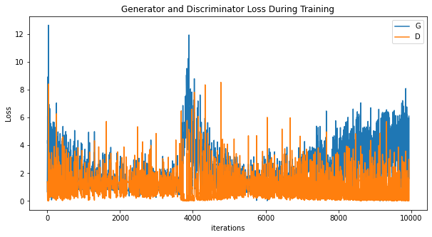
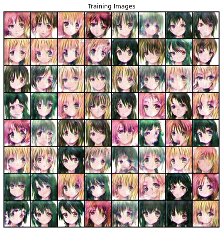

# Anime-Face-Generation
This repository contains code for generating anime character faces using GAN's

# Dataset
The dataset used in this repository is the courtesy of [[1]](#1) and can be easily downloaded from [here](https://www.kaggle.com/datasets/splcher/animefacedataset). The dataloader implementation is based on [this](https://pytorch.org/tutorials/beginner/dcgan_faces_tutorial.html) tutorial.

# Implementation
### Model Architecture
Currently the generator and discriminator are a slightly modified version of the architectures mentioned in [[3]](#3). For generator network, input feature size is a 128 vector, no label embedding has been used as of now. 
The number of sub-pixel cnns is reduced to 2, since the input images are of size 64*64. For similar reasons, in discriminator network number of residual blocks has been reduced to 8 instead of 10.
The discriminator outputs binary output representing wether the image is real or fake, unlike [[3]](#3). 
### Training
For training the modified loss function mentioned in [[2]](#2) is being used. The latent variable z is being sampled from a uniform distribution. 
### Output
Loss function:

Faces:

## References
<a id="1">[1]</a> 
@online{chao2019/online,
  author       = {Brian Chao},
  title        = {Anime Face Dataset: a collection of high-quality anime faces.},
  date         = {2019-09-16},
  year         = {2019},
  url          = {https://github.com/bchao1/Anime-Face-Dataset}
}

<a id="2">[2]</a> 
arXiv:1406.2661

<a id="3">[3]</a> 
arXiv:1708.05509
